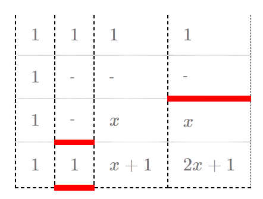
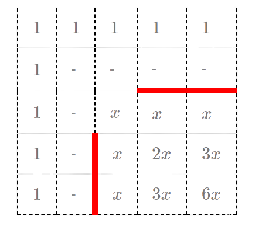
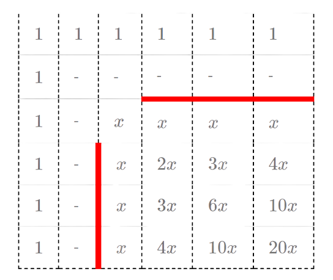
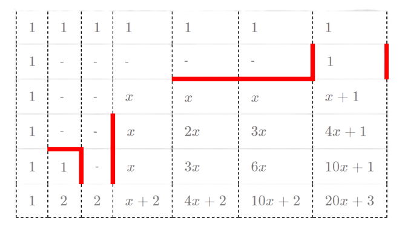
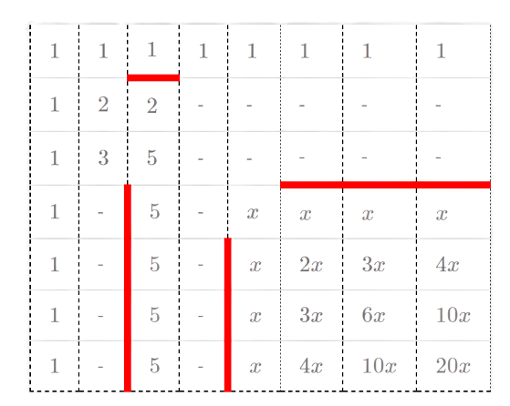
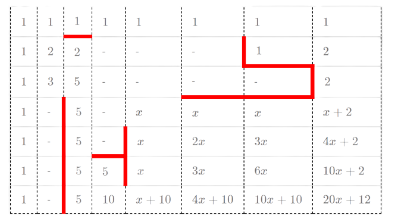

# 2020全國資訊學科能力競賽 解說（NHSPC2020 Editorial）

[Source](https://hiiragi4000.blogspot.com/2020/12/109.html)

因為編者是用一些奇幻(?)的方法來搬運此Editorial的，所以與原文有任何出入請告訴我。

---

<h2 style="text-align: left;">A. 礦砂採集</h2>

這題是很典型的<a href="https://en.wikipedia.org/wiki/Continuous_knapsack_problem" target="_blank">連續背包問題</a>&#12290;結論非常簡單&#65306;只要不斷貪婪地將單位重量價值最大的礦砂放進背包&#65292;直到背包已滿或所有礦砂均已被放入&#65292;就能最大化總價值&#12290;

一個簡單的做法是將所有礦砂依照單位重量價值由大到小排序&#65292;依序放入背包直到滿即可&#12290;複雜度是$O(n \log n)$&#12290;

<h3 style="text-align: left;">線性做法</h3>

雖然並不是本題的考點&#65292;但有一個值得一提的 $O(n)$ 做法存在&#12290;以下為了方便說明&#65292;假定所有的 $x_i$ 均相異&#12290;


1. 隨機選擇一個礦砂 $i$&#65292;並將所有的礦砂分為單位價值 $\ge x_i$ 與 $< x_i$ 兩堆&#12290;
  分歧判斷&#65306;
    - 若單位價值 $\ge x_i$ 的礦砂可以塞滿背包&#65292;則將 $< x_i$ 的礦砂全刪除&#65292;並往大的 $x$ 找答案&#12290;
    - 反之則將價值 $\ge x_i$ 的礦砂全刪除&#65292;往小的 $x$ 找答案&#12290;
  搜尋完後得到的值代表&#12300;總價值最大時&#65292;背包中單位重量價值最小的礦砂&#12301;&#65292;再用這個價值去反求答案&#12290;


演算法與 <a href="https://en.wikipedia.org/wiki/Quickselect" target="_blank">quickselect</a> 非常相似&#65292;期望時間複雜度為 $O(n)$&#12290;

<h2 style="text-align: left;">B. 村莊與小徑</h2>

這題是一道最短路徑的問題&#65292;但給定的限制中有幾個點要注意&#65306;

<ol style="text-align: left;">
  給定的圖是 DAG&#65288;有向無環圖&#65289;&#12290;
  邊權可能是負的&#12290;
</ol>

條件 1 保證這張圖存在拓樸排序&#65292;求解可用 top-down DP&#65292;或找出拓樸排序後用 bottom-up DP&#12290;

```cpp
// ord = 拓樸排序的點順序
// fr[x] = 連到 x 的所有點

fill(dis, dis+n+1, INF);
dis[1] = 0;
for (int i=1; i<=n; i++) {
  int p = ord[i];
  // 找所有能連到 p 的點 j，更新 p 的最短距離
  for (Edge j: fr[p]) dis[p] = min(dis[p], dis[j.to] + j.weight);
}
```

以上的做法複雜度是 $O(n+m)$&#65292;可以在限制內解完所有測資&#12290;

<h3 style="text-align: left;">錯誤&#65295;部分解法</h3>

值得一提的是這題有幾個預設的錯誤解法&#65306;


  1. Dijkstra: 不能處理負權的最短路&#12290;
  2. Bellman&#8211;Ford / SPFA: 這類演算法在最糟情況下的複雜度是 $\Theta(nm)$&#65292;只能過比較小的測資&#12290;&#65288;註&#65306;SPFA 在圖為隨機生成的情況下跑得非常快&#65292;要防止讓 SPFA 過基本上需要構造測資&#12290;不過總而言之確實存在 SPFA 無法解過的測資&#65289;


<h2 style="text-align: left;">C. 樣本解析</h2>

把給定的 $X$ 拆成兩個不相交集合 $X_1$ 和 $X_2$&#65292;再暴力求出所有樣本和 $X_1$ 及 $X_2$ 的交集狀況就可以了&#12290;由於集合的拆法有 $O(2^m)$ 種且枚舉完以後需要花 $O(n)$ 檢查&#65292;總時間複雜度為 $O(2^m \times n)$ ($m$ 為 $X$ 的字元種類數)&#12290;

要怎麼實作得比較簡潔是這一題的重點&#65292;這裡給一些小技巧供參考&#65306;

<h3 style="text-align: left;">用 int 或 std::bitset 表示集合</h3>

一個集合可以用一個 int 儲存&#65292;其中第 $i$ 個 bit 記錄這個集合有沒有第 $i$ 個元素&#12290;接下來就能利用 bitwise and/or 等內建運算來算出題目大部分的所求&#12290;如果不喜歡位元運算&#65292;C++ 也有提供 std::bitset 以協助實作&#12290;

<h3 style="text-align: left;">枚舉所有的子集合</h3>

若用 int 儲存集合&#65292;可以用一個 for 迴圈枚舉所有的子集合&#12290;

```cpp
for (int i=x; ; i=(i-1)&x) {
  cout << i << '\n';
  if (i==0) break;
}
```

這個迴圈枚舉並輸出 $x$ 的每個子集合 $i$&#65292;是常見且有效率的寫法&#12290;

<h3 style="text-align: left;">觀察細節</h3>

題目所求的 $P_5$ 是比較難算的部分&#65292;但仔細想一想可以發現 $P_5$ 只能是 $0$ 或 $2$&#12290; 以下簡單說明&#65306;


  1. 不失一般性&#65292;假定 $X$ 和 $S_1$ 有部分交集的關係&#65292;取任意 $x \in X\cap S_1$&#12290;
  2. 如果 $(X_1, X_2)$ 是合法的拆分&#65292;交換 $X_1$ 與 $X_2$ 後仍然是一個合法的拆分&#65292;故不失一般性假定 $x \in X_1$&#12290;
  3. 我們發現 $X_1$ 只能是 $X\cap S_1$&#65288;此時 $P_5 = 2$&#65289;&#65292;否則無解&#65288;此時 $P_5 = 0$&#65289;&#12290;
    如果存在某個 $y\in X_1$ 但 $y\notin X\cap S_1$&#65292;則 $y\notin S_1$&#65307;但這代表 $X_1$ 和 $S_1$ 有部分交集&#65292;矛盾&#12290;因此 $X_1\subseteq X\cap S_1$&#12290;
    如果存在某個 $y\in X\cap S_1$ 但 $y\notin X_1$&#65292;則 $y\in X_2$&#65307;但這代表 $X_2$ 和 $S_1$ 有部分交集&#65292;矛盾&#12290;因此 $X\cap S_1\subseteq X_1$&#12290;
  

當然這題測資範圍並不要求觀察出這個結論&#65292;即使枚舉所有的子集合仍然能拿到滿分&#12290;

<h2 style="text-align: left;">D. 水果包裝</h2>

<h3 style="text-align: left;">觀察與結論</h3>

換個方式來思考這一題&#65306;假設每次機器在選定最小重量的袋子後&#65292;由你決定放入哪顆水果&#12290;那麼這題存在一個非常簡單的結論&#65306;如果給定的包裝結果是可能的&#65292;只要重量越輕的水果越先放&#65292;總是能達成該包裝結果&#12290;


  或許這個結論不難猜&#65292;但要好好證明也許會花點時間&#12290;假設題目給定的包裝是存在解的&#65292;也就是存在一個解的序列&#65306;
  \[(b_1, w_1), (b_2, w_2), \cdots,(b_n, w_n).\]
  這裡用 $(b_i, w_i)$ 代表第 $i$ 步驟的水果放在第 $b_i$ 袋&#65292;且放的水果重量為 $w_i$&#12290;


  我們將焦點放在這個解序列中&#65292;由&#12300;放入相同袋子的兩步驟&#12301;所形成的子區間&#65306;
  \[(b, w_1), \cdots, (b, w_2).\]
  可以發現上述序列若 $w_1 > w_2$&#65292;我們其實可以交換這兩個步驟的順序&#65292;且合法的解仍然存在&#65306;
  \[(b, w_2), \cdots, (b, w_1), \cdots\]
  儘管交換後 $b$ 一度變輕導致 $(b, w_1)$ 可能會比原本 $(b, w_2)$ 的位置還前面&#65292;我們發現在放完 $w_1$ 後&#65292;只要這個子區間的水果還沒被放完&#65292;$b$ 就不會是最輕的&#65292;因此這樣的操作是合法的&#12290;&#65288;當然&#65292;對放水果順序的影響只會出現在注目的子區間內&#65292;子區間外的所有順序都無需改動&#12290;&#65289;


經過複數次上述&#12300;交換同袋子水果順序&#12301;的操作以後&#65292;我們可以將任意一個解的序列交換成對每個袋子而言收到的水果重量皆為從小到大&#12290;由於任意解的順序都可以經由以上的交換得到同一個序列&#65292;若從小拿到大仍然無法滿足題目給定的包裝&#65292;代表無解&#12290;

<h3 style="text-align: left;">實作 O( n(log n + log m) )</h3>

實作上我們會需要一個資料結構可以

  1. 知道現在最輕且編號最小的袋子 $b$&#12290;
  2. 將還沒放入 $b$ 且最輕的水果放進 $b$ 裡&#65292;並更新 $b$ 的重量&#12290;

只要將包裝結果中的每個袋子的水果依重量排序&#65292;便可隨時查出該將哪個水果放入袋子中&#65307;找出最輕的袋子與更新重量部分&#65292;可以用堆積或 `std::priority_queue` 維護&#65292;在 $O(\log m)$ 時間完成每個操作&#12290;因此整體的複雜度為 $O(n(\log n+\log m))$&#12290;

<h2 style="text-align: left;">E. 共同朋友</h2>

<h3 style="text-align: left;">O(n&#179;)</h3>

首先這題有一個簡單的 naive $O(n^3)$ 做法:

```cpp
for (int i=1; i<=n; i++) {
  for (int j=i+1; j<=n; j++) {
    if (have_common_friends(i, j))
      answer++;
  }
}
```

計算 <span style="font-family: Consolas;">have_common_friends()</span> 最簡單的方法是寫一個迴圈&#65292;需時 $O(n)$&#12290;

<h3 style="text-align: left;">O(n&#179;/B)</h3>

我們利用 `std::bitset` f[i] 的第 $j$ 個 bit 記錄 $i$ 和 $j$ 是不是朋友&#65292;以優化上述 <span style="font-family: Consolas;">have_common_friends()</span> 的迴圈實作&#12290;想求 $i$ 和 $j$ 有沒有共同朋友時&#65292;可用 std::bitset 的 and 運算與 method any() (i.e. (f[i] &amp; f[j]).any()) 得出&#12290;

由於 `std::bitset` 的實作方式為 bit array&#65292;執行時間會比一般的陣列快數十倍以上&#12290;當然自己用陣列來實作 bit array 也是可行的&#65306;

```cpp
unsigned bit(int x) {
  return 1u << x;
}

void add_friend(int i, int j) {
  j--;
  f[i][j/32] |= bit(j%32);
}

bool have_common_friends(int i, int j) {
  int len = (n+31) / 32;
  for (int k=0; k<len; k++) {
    if (f[i][k] & f[j][k]) return true;
  }
  return false;
}
```


<h2 style="text-align: left;">F. 歡樂外送點</h2>

從題敘中的圖 1 可以觀察到所有的商店服務範圍都是一個 $45$ 度的正方形&#65292;要怎麼把這題的座標轉 $45$ 度好好用區間資料結構維護就是這一題的重點&#12290;

<h3 style="text-align: left;">座標變換</h3>


  考慮將平面上的所有點做如下的變換&#65306;
  \[\begin{pmatrix}x\\y\end{pmatrix} \mapsto \begin{pmatrix}x'\\y'\end{pmatrix} := \begin{pmatrix}x+y\\x-y\end{pmatrix}.\]
  可以發現變換前兩點 $(x_1, y_1), (x_2, y_2)$ 的曼哈頓距離 $|x_1-x_2| + |y_1-y_2|$ 等於變換後兩點 $(x_1', y_1'), (x_2', y_2')$ 的<a href="https://en.wikipedia.org/wiki/Chebyshev_distance" target="_blank">切比雪夫距離</a> $\max\{|x_1'-x_2'|, |y_1'-y_2'|\}$&#12290;在變換後原 $(x, y, r)$ 的範圍就會變成以新座標 $(x+y, x-y)$ 為中心&#65292;邊長 $2r$ 且邊平行於 $x, y$ 軸的正方形&#65292;也就是說一個映射後的座標 $(a', b')$ 若滿足
  \[\begin{cases}x'-r\leq a'\leq x'+r,\\y'-r\leq b'\leq y'+r,\end{cases}\]
  則 $(a, b)$ 與 $(x, y)$ 的曼哈頓距離在 $r$ 以內&#12290;注意題目所求為變換前的整數點&#65292;而變換後的某個整數點 $(x', y')$ 在變換前也是整數點 (i.e. $(\frac{y'-x'}{2}, \frac{y'+x'}{2}) \in \mathbb{Z}^2$) 的充分必要條件是 $x'\equiv y'\ (\operatorname{mod}2)$&#65292;必須小心處理奇偶性問題&#12290;


值得一提的是這個變換在程式競賽中頗常見&#65292;例如 IOI2017 的 <a href="https://hsin.hr/ioi2007/tasks/solutions.pdf" target="_blank">pair</a> 也出現一樣的技巧&#12290;上面連結的解析裡面有對這個變換的證明&#65292;如果讀者對<a href="https://en.wikipedia.org/wiki/Rotation_matrix" target="_blank">旋轉矩陣</a>不熟&#65292;推薦可以直接把這個變換記起來&#12290;

<h3 style="text-align: left;">掃描線</h3>

做完上述變換後&#65292;在不考慮題目問的是整數點的情況下&#65292;可以把題目簡化成這樣&#65306;

&#12300;平面上有一些與 $x,y$ 軸平行的矩形&#65292;每塊矩形皆有權重&#12290;定義一個點的點負重為所有覆蓋該點的矩形的權重和&#65292;請求出點負重的最大值&#12290;&#12301;

這個問題是一個含有區間更新的 2D RMQ 問題&#65292;但因為所有矩形為已知&#65292;可以離線利用<a href="https://en.wikipedia.org/wiki/Sweep_line_algorithm" target="_blank">掃描線</a>掃其中一軸&#65292;並用線段樹或平衡二元搜尋樹維護掃描線上的最大值&#65292;時間複雜度 $O(n \log n)$&#12290;

由於原始題目有 $x'\equiv y'\ (\operatorname{mod}2)$ 這個條件&#65292;無法直接套用上述的演算法&#65292;必須做一些處理&#12290;這裡提供兩個參考做法&#65306;


  1. 用兩棵線段樹維護掃描線上的最大值&#65292;一棵只維護奇數座標而另一棵維護偶數座標&#65292;查詢時再根據掃描線掃過的範圍決定查哪棵線段樹&#12290;
  2. 只考慮 $x^{\prime}, y^{\prime}$ 同奇偶的座標並將座標除以 $2$&#12290;以偶數座標為例&#65292;若原範圍為 $[2, 5]$ 可以將奇數座標去掉 $[2, 4]$ 再除以 2 變成 $[1, 2]$&#12290;變換完的座標就可以忽略同奇偶限制直接套用上述的掃描線演算法&#12290;


這個將 2D 問題轉成掃描線降維的技巧相當著名&#65292;一個應用是計算二維的矩形面積覆蓋問題 (<a href="https://www.topcoder.com/community/competitive-programming/tutorials/line-sweep-algorithms" target="_blank">ref1</a>, <a href="https://stackoverflow.com/questions/55702005" target="_blank">ref2</a>)&#65292;
有 $40$ 多年的<a href="https://en.wikipedia.org/wiki/Segment_tree#History" target="_blank">歷史</a>了&#12290;由於這個技巧在網路上可以找到的資源非常多&#65292;限於篇幅這裡就不詳細介紹了&#65292;對此技巧不熟的讀者也能從學著做這題開始&#12290;

<h2 style="text-align: left;">G. 矩陣相乘</h2>

本節假定讀者知道什麼是機率分佈與隨機變數&#65292;並了解&#12300;一組隨機變數為 iid (independent and identically distributed&#65292;獨立同分佈)&#12301;的意思&#12290;此外&#65292;為了討論方便&#65292;以下先約定一些符號&#65306;


  - $\mathbb{Z}_p$ 為元素個數為 $p$ 的體 (field)&#65292;亦即在集合 $\{0, 1, \ldots, p-1\}$ 上定義加法與乘法為模 $p$ 運算的代數結構&#65292;而 $\mathbb{Z}_p^\times$ 為 $\mathbb{Z}_p$ 內有乘法反元素的元素集合 (aka $\{1, 2, \ldots, p-1\}$)&#12290;
  - $\mathbb{Z}_p^n$ 為佈於 $\mathbb{Z}_p$ 的 $n$ 維向量空間&#65292;而 $\mathcal{M}_{n\times m}(\mathbb{Z}_p)$ 則為所有元素皆在 $\mathbb{Z}_p$ 裡的 $n\times m$ 矩陣所形成的集合&#12290;
  - 設 $\mathbf{v} \in \mathbb{Z}_p^n$&#12290;我們用 $v_i$ 或 $(\mathbf{v})_i$ 代表 $\mathbf{v}$ 的第 $i$ 個分量&#12290;
  - 設 $\mathbf{A} = (a_{ij})_{1 \leq i \leq n, 1 \leq j \leq m}$ 為一矩陣&#12290;我們用 $\mathbf{A}_{u: d; l: r}$ 代表子矩陣 $(a_{ij})_{u \leq i \leq d, l \leq j \leq r}$&#12290;
  - 設 $E$ 為一機率事件&#12290;我們用 $\mathbb{P}[E]$ 代表 $E$ 發生的機率&#12290;
  - 設 $X$ 為一隨機變數且 $D$ 為一機率分佈&#12290;我們用 $X \sim D$ 代表 $X$ 服從分佈 $D$&#12290;
  - 設 $S$ 為一有限非空集合&#12290;$S$ 上的均勻分佈記為 $\mathcal{U}(S)$&#65292;亦即若一隨機變數 $X \sim \mathcal{U}(S)$&#65292;則對任意 $x \in S$&#65292;均有 $\mathbb{P}[X = x] = 1/|S|$&#12290;


<h3 style="text-align: left;">觀察</h3>

直接用矩陣乘法定義計算 $\mathbf{AB}$ 需要 $O(n^3)$ 時間&#65292;這在 $n=2800$ 時並沒有辦法在時限內完成計算&#65307;另一方面&#65292;$\mathbf{AB}$ 稀疏並不保證 $\mathbf{A}$ 和 $\mathbf{B}$ 也是稀疏&#65292;故改用稀疏矩陣乘法也不能改善效率&#12290;但


  1. 如果已經知道 $\mathbf{C} = \mathbf{AB}$ 的所有非 $0$ 元素位置&#65292;只需要 $O(n^2)$ 時間便可完成剩下的計算&#12290;
  2. 給定 $\mathbf{v} \in \mathbb{Z}_p^n$&#65292;我們可以在 $O(n^2)$ 時間內計算出 $\mathbf{Cv} = (\mathbf{AB})\mathbf{v} = \mathbf{A}(\mathbf{Bv})$&#12290;


設 $\mathbf{v} \in \mathbb{Z}_p^n$&#12290;若 $\mathbf{C}$ 的第 $i$ 列全為 $0$&#65292;則我們有 $(\mathbf{Cv})_i = 0$&#65307;若 $\mathbf{C}$ 的第 $i$ 列有任一元素 (aka $c_{ij}$) 非 $0$&#65292;直覺告訴我們當 $p$ 夠大且 $\mathbf{v}$ 為隨機時&#65292;$(\mathbf{Cv})_i = c_{i1}v_1+c_{i2}v_2+\ldots+c_{in}v_n$ 有很大機會不為 $0$&#12290;以下讓我們把這件事情好好地寫下來並加以證明&#65292;讓妄想成為現實&#12290;

<b>[定理A] 設 $X_1, X_2, \ldots, X_n \sim \mathcal{U}(\mathbb{Z}_p)$ 為 iid&#12290;若 $c_1, c_2, \ldots, c_n \in \mathbb{Z}_p^\times$&#65292;則我們有 \[c_1X_1 + c_2X_2 + \ldots + c_nX_n \sim \mathcal{U}(\mathbb{Z}_p).\]</b>

我們對 $n$ 用數學歸納法來證明&#12290;當 $n = 1$ 時&#65292;設 $x \in \mathbb{Z}_p$&#65292;則有 \[\mathbb{P}[c_1X_1 = x] = \mathbb{P}[X_1 = x/c_1] = 1/p.\] 注意 $x$ 可以是任意的&#65292;故 $c_1X_1 \sim \mathcal{U}(\mathbb{Z}_p)$&#12290;

當 $n \geq 2$ 時&#65292;設 $x \in \mathbb{Z}_p$&#65292;則有


  \[\begin{split}
  \mathbb{P}[c_1X_1 + \ldots + c_nX_n = x] &= \sum_{y\in\mathbb{Z}_p}\mathbb{P}[c_1X_1 + \ldots + c_{n-1}X_{n-1} = y,\ c_nX_n = x-y]\\
  &= \sum_{y\in\mathbb{Z}_p}\mathbb{P}[c_1X_1+\ldots+c_{n-1}X_{n-1}=y]\mathbb{P}[c_nX_n = x-y]\\
  &= \sum_{y \in \mathbb{Z}_p}(\frac{1}{p})(\frac{1}{p}) = 1/p.
  \end{split}\]
上式的第二行用到了不同 $X_i$ 之間的獨立性&#65292;而第三行用到了歸納法假設與 $n=1$ 的結論&#12290;又 $x$ 可以是任意的&#65292;本定理得證&#12290;

我們把定理A寫成比較容易用的形式&#65306;

<b>[推論A] 設 $X_1, X_2, \ldots, X_n \sim \mathcal{U}(\mathbb{Z}_p)$ 為 iid&#12290;已知 $c_1, c_2, \ldots, c_n \in \mathbb{Z}_p$ 並令 $Y = c_1X_1 + c_2X_2 + \ldots + c_nX_n$&#65292;則</b>
  - **若存在某個** $c_i \neq 0$&#65292;**則** $Y \sim \mathcal{U}(\mathbb{Z}_p)$&#12290;
  - **若** $c_i = 0$ **對於每個** $i$&#65292; **則** $Y = 0$&#12290;

<h3 style="text-align: left;">演算法</h3>

我們用以下的函式來展示演算法是怎麼進行的&#12290;這個函式接受兩個參數 $\mathbf{A'} \in \mathcal{M}_{r\times n}(\mathbb{Z}_p), \mathbf{B'} \in \mathcal{M}_{n\times m}(\mathbb{Z}_p)$&#65292;回傳 $\mathbf{C'} = \mathbf{A'B'} \in \mathcal{M}_{r\times m}(\mathbb{Z}_p)$ 中所有非 $0$ 元素的位置&#12290;初始我們將 $\mathbf{A'}\gets\mathbf{A}, \mathbf{B'}\gets\mathbf{B}$ 傳入這個函式&#12290;


  1. 生成 $t$ 個隨機向量 $\mathbf{v_1}, \mathbf{v_2}, \ldots, \mathbf{v_t}$&#65292;其中 $(\mathbf{v_i})_j \sim \mathcal{U}(\mathbb{Z}_p)$&#65292;且這 $tn$ 個分量為 iid&#12290;
  2. 計算 $\mathbf{C'v_1}, \mathbf{C'v_2}, \ldots, \mathbf{C'v_t}$&#12290;
  3. 若某個 $i$ 滿足 $(\mathbf{C'v_1})_i = (\mathbf{C'v_2})_i = \ldots = (\mathbf{C'v_t})_i = 0$&#65292;則判定 $\mathbf{C'}$ 的第 $i$ 列全為 $0$&#65307;否則 $\mathbf{C'}$ 的第 $i$ 列必定不全為 $0$&#12290;

      - 如果某個隨機向量 $\mathbf{v_j}$ 求出來的 $(\mathbf{C'v_j})_i$ 不等於 $0$&#65292;則代表 $\mathbf{C'}$ 的第 $i$ 列一定有個非 $0$ 的元素在&#12290;
      - 若某個隨機向量 $\mathbf{v_j}$ 求出來的 $(\mathbf{C'v_j})_i$ 等於 $0$&#65292;有可能 $\mathbf{C'}$ 的第 $i$ 列真的全部都是 $0$&#65292;或者第 $i$ 列並不全為 $0$ 但運氣不好中了 $1/p$ 的機率誤判&#12290;
      - 這裡隨機選擇多條向量來測試&#65292;並將所有向量求出非 $0$ 的位置取聯集得到最後的結果&#65292;增加找出所有非 $0$ 列的信心&#12290;

  4. 設上步驟中&#65292;沒被判為 $0$ 的列編號形成的集合為 $N$&#12290;

      - 若此時 $\mathbf{C'}$ 的行數為 $1$&#65292;則每個 $i \in N$ 皆對應一個非 $0$ 元素&#65292;停止計算&#12290;
      - 否則從 $\mathbf{A'}$ 抽出對應的列得到 $\mathbf{A'_N}$&#65292;並令 $\mathbf{B'_L} = \mathbf{B'}_{1:n; 1:\lfloor m/2\rfloor}, \mathbf{B'_R} = \mathbf{B'}_{1:n; \lfloor m/2\rfloor+1: m}$ (左半與右半)&#12290;接著令 $\mathbf{C'_L} = \mathbf{A'_NB'_L}, \mathbf{C'_R} = \mathbf{A'_NB'_R}$&#65292;並遞迴計算 $\mathbf{C'_L}$ 和 $\mathbf{C'_R}$&#12290;
    tl; dr: 求出非 $0$ 的列編號後&#65292;對 $\mathbf{C'}$ 的每一非 $0$ 列切成左右兩邊&#65292;縮小搜尋範圍&#12290;


計算 $\mathbf{C'v_i} = \mathbf{A'}(\mathbf{B'v_i})$ 需要 $O(n(m+r))$ 時間&#12290;考慮在同一遞迴深度下的所有函式呼叫&#65292;我們有


  - $m$ 的和不超過 $n$&#12290;
  - 由於 $\mathbf{C}$ 最多只有 $2n$ 個非 $0$ 元素&#65292;$r$ 的和不超過 $4n$&#12290;


因此每一層遞迴呼叫的總計算量為 $O(tn^2)$&#12290;最後由 $\mathbf{B}$ 的大小為 $n\times n$ 可知最大遞迴深度為 $O(\log n)$&#65292;故時間複雜度為 $O(tn^2 \log n)$&#12290;

<h3 style="text-align: left;">估計</h3>


  上述的演算法並不保證 $100\%$ 能得出正確的結果&#12290;由推論 A 知&#65292;若 $\mathbf{C'}$ 的第 $i$ 列不全為 $0$&#65292;則對任意 $j \in \{1, 2, \ldots, t\}$&#65292;$(\mathbf{C'v_j})_i = c_{i1}(\mathbf{v_j})_1+c_{i2}(\mathbf{v_j})_2+\ldots+c_{in}(\mathbf{v_j})_n$ 仍有 $1/p$ 的機率為 $0$&#65292;亦即一個不全為 $0$ 的列被誤判的機率為 $1/p^t$&#12290;在同一遞迴深度下最多只有 $2n$ 個不全為 $0$ 的列&#65292;而最大遞迴深度為 $\lceil\log_2 n\rceil+1$&#65292;可知完整的計算過程中&#65292;至少一列被判錯的機率不高於
  \[\frac{2n (\lceil\log_2 n \rceil+1)}{p^t} \leq \frac{5600\cdot13}{37^t} = 72800/37^t.\]
  於是只要挑 $t = 5$&#65292;即可讓錯誤的機率降低至不到 $1\%$&#12290;


一個值得注意的是&#65292;唯有每個 $j$ 皆滿足 $(\mathbf{C'v_j})_i = 0$ 時&#65292;才能斷定 $\mathbf{C'}$ 的第 $i$ 列全為 $0$&#65307;如果做法不同&#65292;可能會對錯誤率的估計造成很大的影響&#12290;以下介紹本題的另一個做法&#65306;設定 $t=1$ 並呼叫函式 $s$ 次&#65292;最後把得到的結果 (i.e. 非 $0$ 元素位置所形成的集合) 取聯集&#12290;儘管看起來跟原做法很像&#65292;上一段的估計並不能使用&#65292;實際測試 $s = 5$ 大部分時候也會得到錯誤的結果&#65292;必須重新為這個演算法估計出錯機率&#12290;

考慮 $\mathbf{C}$ 的一個非 $0$ 元素 $c_{ij}$&#65292;不妨假設某次呼叫 $c_{ij}$ 被分到 $\mathbf{C'}$ 的第 $i'$ 列&#12290;如果 $(\mathbf{C'v_1})_{i'} = 0$&#65292;那麼 $c_{ij}$ 就不會被發現&#12290;由於遞迴深度不超過 $13$&#65292;我們知道 $c_{ij}$ 沒被發現的機率不超過 $1-(36/37)^{13} < 0.3$&#65292;故呼叫函式 $s$ 次均沒有被發現的機率不超過 $0.3^s$&#12290;另&#65292;由非 $0$ 元素個數不超過 $2n \leq 5600$ 個&#65292;可知計算完成後&#65292;有非 $0$ 元素沒被找出來的機率不超過 $5600\cdot0.3^s$&#65292;於是只要取 $s = 11$&#65292;即可讓錯誤的機率降低至不到 $1\%$&#12290;

<h3 style="text-align: left;">部分分解法</h3>

<h4 style="text-align: left;">子任務 1</h4>


  在這個子任務中&#65292;$\mathbf{C}$ 的每列只有一個非 $0$ 元素&#65292;不妨設第 $i$ 列的非 $0$ 元素的值為 $c_i$&#65292;位置在 $(i, j_i)$ 吧&#12290;首先觀察
  \[\mathbf{C}\begin{pmatrix}1\\1\\\vdots\\1\end{pmatrix} = \begin{pmatrix}c_1\\c_2\\\vdots\\c_n\end{pmatrix}.\]
  這樣一來就能在 $O(n^2)$ 時間內知道 $c_i$ 了&#12290;這個子任務中另一個比較容易被忽略的條件是 $p \geq 2801$&#65292;這代表 $p > n$&#12290;這樣一來我們有
  \[\mathbf{C}\begin{pmatrix}1\\2\\\vdots\\n\end{pmatrix} = \begin{pmatrix}c_1j_1\\c_2j_2\\\vdots\\c_nj_n\end{pmatrix}.\]
  只要求得 $c_i$ 在 $\mathbb{Z}_p^\times$ 下的反元素&#65292;便能推出 $j_i$&#12290;這不僅是正確機率 $100\%$ 的演算法&#65292;時間複雜度還只要 $O(n^2)$&#12290;


<h4 style="text-align: left;">子任務 2</h4>


  在這個子任務中&#65292;修改一開始介紹的&#12300;隨機&#12301;演算法&#65292;便能得到一個 $100\%$ 正確的做法&#12290;取
  \[\mathbf{v_1} = \begin{pmatrix}1\\1\\\vdots\\1\end{pmatrix}, \mathbf{v_2} = \begin{pmatrix}1\\2\\\vdots\\m\end{pmatrix}\]
  用這兩個向量測試保證可以找出所有的非 $0$ 元素&#12290;因為若 $c_{i,x}$ 與 $c_{i,y}$ $(x \neq y)$ 非 $0$&#65292;用 $\mathbf{v_1}$ 誤判出 $0$ 的條件是 $c_{i,x} + c_{i,y} = 0$&#65292;而此時
  \[(\mathbf{Cv_2})_i = c_{i,x} x + c_{i,y} y = (c_{i,x} + c_{i,y})x + c_{i,y}(y-x) = c_{i, y}(y-x).\]
  由於 $m \leq n < p$&#65292;我們有 $y-x \neq 0$&#65292;因此 $(\mathbf{Cv_2})_i = c_{i,y}(y-x) \neq 0$&#12290;


時間複雜度如同前面分析過的&#65292;為 $O(n^2 \log n)$&#65292;但這次演算法 $100\%$ 會得出正確的結果&#12290;

<h2 style="text-align: left;">H. 跑跑遊戲場</h2>

<style>
table {
  border-collapse: collapse;
  padding: 0; }
  table tr {
    border-top: 1px solid #cccccc;
    background-color: white;
    margin: 0;
    padding: 0; }
    table tr:nth-child(2n) {
      background-color: #f8f8f8; }
    table tr th {
      font-weight: bold;
      border: 1px solid #cccccc;
      text-align: left;
      margin: 0;
      padding: 6px 13px; }
    table tr td {
      border: 1px solid #cccccc;
      text-align: left;
      margin: 0;
      padding: 6px 13px; }
    table tr th :first-child, table tr td :first-child {
      margin-top: 0; }
    table tr th :last-child, table tr td :last-child {
      margin-bottom: 0; }
table tr td {
  border-style: dashed;
  border-width: 1px;
  border-color: black;
}
.cd {
  border-bottom-style: solid !important;
  border-bottom-width: 5px !important;
  border-bottom-color: red !important;
}
.cr {
  border-right-style: solid !important;
  border-right-width: 5px !important;
  border-right-color: red !important;
}
</style>

<h3 style="text-align: left;">觀察</h3>

首先要湊到的路徑數最大是 $10^{18}$ 種&#65292;能湊到這麼多走法且周長最小的地圖是 $33 \times 33$&#65292;走法數 $\binom{64}{32} \approx 1.8 \times 10^{18}$&#12290;

注意此時半周長為 $66$&#65292;和題目要求的上限 $90$ 相差不到一半&#65292;可以擴展的空間其實不多&#12290;解題的時候如果能意識到&#12300;用加法的構造法&#12301;(i.e. 把 $T$ 分解成多個數字再分別加起來的構造法&#65292;或者是類似的遞迴構造法) 窒礙難行&#65292;可能會是一個非常有幫助的提示&#12290;

<h3 style="text-align: left;">2 進位</h3>

如果往乘法的方向來構造解答的話&#65292;可以發現一個可行的方向是利用進位制來操作&#12290;下面為 $2$ 進位的例子&#65306;


<br />



以上兩圖為例&#65292;如果在地圖的最上方與最左方留下一列及一行 $1$&#65292;可以透過操作紅色閘門來將任意一個數字 $x$ 變成 $2x$ 或者 $2x+1$&#12290;依照上述的方法將 $T$ 拆成 $2$ 進位來構造可以得到一個 $n+m = 121$ 左右的解&#65292;得分為 $38$ 分&#12290;

<h3 style="text-align: left;">6 進位&#65295;10 進位</h3>

多進位的思考方式和 $2$ 進位差不多&#65292;主要的差別是細節處理的 case 會比較多&#12290;以 $6$ 進位為例&#65306;



這裡要注意的是上面以及左邊的兩道門&#65292;如果將門打開的話讓最上面&#65295;最左邊的 $1$ 直接進到構造區域的話可以調整最終 $6x$ 那格的大小&#12290;

  - 左邊門 $1$(左邊上面): 走法數增加 $3$&#12290;
  - 左邊門 $2$: 走法數增加 $1$&#12290;
  - 上方門 $1$: 走法數增加 $3$&#12290;
  - 上方門 $2$: 走法數增加 $1$&#12290;


運用這兩個 $+3$ 及 $+1$ 的閘門可以湊出 $6x$ 到 $6x+5$ 間的所有整數&#12290;以 $6x+5$ 為例&#65292;我們開 $3$ 個門 $3+1+1$ 來湊出餘數 $5$&#65306;


在 $6$ 進位的例子中&#65292;每湊一個位數需要多 $2$ 列及 $2$ 行&#12290;由於 $10^{18}$ 寫成 $6$ 進位會有 $24$ 位數&#65292;構造出的地圖半周長 $n+m$ 的最大值是 $4 + (2+2) \times 24 = 100$&#12290;

類似地也有 $10$ 進位用 $4\times3$ 方格的構造法&#65292;每湊一個位數需要多 $3$ 列及 $2$ 行&#65292;構造出的地圖半周長為 $4 + (2+3) \times 19 = 99$&#12290;

<h3 style="text-align: left;">20 進位</h3>

再更往上的進位構造方法仍然類似&#65292;但細節又再更複雜一些&#12290;以 $20$ 進位為例&#65306;



這個時候如果照之前 $6$ 與 $10$ 進位的作法&#65292;上面與左邊的門打開能影響的走法數分別為&#65306;$+10, +4, +1, +10, +4, +1$&#12290;可以發現有一些 $20$ 以內的正整數是湊不到的&#65292;這裡提供幾個解決的方向&#65306;

<h4 style="text-align: left;">方向 1&#65306;左邊空兩行</h4>

在最左邊放兩行可以幫助湊到一個 $2$&#65292;進而湊出 $3$ 與 $13$ 等原本湊不出來的餘數&#12290;以下圖為例可以在左邊湊出一個 $2$ 與利用上面的 $1$ 來湊出餘數 $3$&#65306;



這個做法完全繼承了上面 $6$ 進位的做法&#65292;只在當餘數為 $3,13$ 時才將 $2$ 拿出來湊餘數&#65292;半周長 $n+m = 89$&#12290;

<h4 style="text-align: left;">方向 2&#65306;湊出一個 5-channel</h4>

在最左邊湊出一行 $5$ 的 channel&#65292;可以利用這個 channel 將 $5,10,15$ 送到構造區域的最下列&#65292;再利用上列的 $1$ 構造出 $1,2,3,4$ 的組合&#12290;



如上圖在 $(3,3)$ 可以湊出第一個 $5$&#12290;接著就可以利用上面的 $4$ 個 $1$ 與左邊的 $3$ 個 $5$ 才湊出所有餘數&#12290;以 $12$ 為例&#65292;需要 $2$ 個 $5$ 與 $2$ 個 $1$&#65306;



這個解法可以在第一個 $4 \times 5$ 構造出 $0$ 到 $19$ 之間的所有整數&#65292;接下來每擴張 $3$ 列 $3$ 行又會再多一位數&#12290;因此需要半周長 $87$&#12290;

<h2 style="text-align: left;">I. 黑白機</h2>

<h3 style="text-align: left;">建議</h3>

做過很多動態規劃的人&#65292;這題可以練習自己想想看&#12290;

<h3 style="text-align: left;">枚舉解</h3>

枚舉所有安排方法共 $2^n$ 種&#65292;每種方法花 $O(n)$ 時間計算最終時間&#65292;取最小值即可&#12290;時間複雜度 $O(n2^n)$&#65292;適用於第一子任務&#12290;

<h3 style="text-align: left;">觀察</h3>

老練的直覺會告訴我們這題解法不是動態規劃就是貪婪&#12290;

老練關鍵&#65306;題目為一個序列每個位置要做一些決定&#65292;我們大膽假設根據前綴 $(1, 2, 3, \ldots, i-1)$ 的最佳解可以推導出前綴 $i$ 的最佳解&#12290;

<h3 style="text-align: left;">狀態設定</h3>

<h4 style="text-align: left;">錯誤狀態&#65288;一&#65289;</h4>

設 $D_i$ 為完成工作 $1$ 到工作 $i$ 的最短時間&#12290;透過手算可以得知第一筆範例測試的 $D = 1, 2, 7, 10$&#12290;

可以發現在這個狀態設計下怎麼列轉移式都是錯的&#65292;因為工作 $i$ 做完後會根據它是在黑機或白機完成而後續產生不同效果&#12290;

<h4 style="text-align: left;">錯誤狀態&#65288;二&#65289;</h4>

由錯誤狀態&#65288;一&#65289;我們知道要多記一個維度代表工作 $i$ 是在哪裡完成的&#12290;設 $D^h_i$ 為完成工作 $1$ 到工作 $i$ 且工作 $i$ 在 $h$ 機完成的最短時間&#65292;其中 $h=0$ 代表白機&#65292;$h=1$ 代表黑機&#12290;透過手算可以得知第一筆範例測試的 $D^0 = 2, 4, 7, 12$&#12289;$D^1 = 1, 2, 9, 10$&#12290;

可以發現在這個狀態設計下列完轉移式有機會通過範例測試&#65292;但上傳後卻不能 AC&#65292;因為工作 $i$ 在白機完成的時間會根據前面有多少個連續的工作在黑機上而有不同的延遲時間&#12290;

<h4 style="text-align: left;">堪用狀態</h4>

若工作 $i$ 在 $h$ 機完成而工作 $i-1$ 在 $1-h$ 機完成&#65292;我們稱 $i$ 為一個交換點&#12290;為了方便討論&#65292;我們加入工作 $0$&#65292;其中 $b_0 = w_0 = t_0 = 0$&#65292;這樣一來所有的安排方法都至少有一個交換點 $1$&#12290;

設 $D^h_i$ 為在 $1-h$ 機完成工作 $i-1$ 的情況下&#65292;$h$ 機開始工作 $i$ 的最早可能時刻&#12290;透過手算可以得知第一筆範例測試的 $D^0 = 0, 5, 5, 10$&#12289;$D^1 = 0, 6, 6, 8$&#12290;


  在這個狀態設計下&#65292;我們算完 $D^0$ 和 $D^1$ 後&#65292;枚舉最後一個交換點的 $2n$ 種可能&#65292;就能涵蓋所有的安排方法&#12290;更明確地說&#65292;我們的答案為
  \[\min\left\{\min_{1\leq i\leq n}\left\{D^0_i+\sum_{k=i}^nw_k\right\}, \min_{1\leq i\leq n}\left\{D^1_i+\sum_{k=i}^nb_k\right\}\right\}.\]


<h4 style="text-align: left;">邊界值</h4>

$D^0_1 = D^1_1 = 0$&#12290;

<h4 style="text-align: left;">轉移式&#65288;一&#65289;</h4>


  這邊只列出白機 (i.e. $D^0$) 的轉移式&#65307;黑機的轉移式可直接由對稱性得出&#12290;
  \[D^0_i = \min_{1\leq p\leq i-1} \left(D^1_p + \max_{p\leq c\leq i-1}\left(\sum_{k=p}^c b_k + t_c\right)\right).\]
  其中 $p$ 為前一個交換點&#65292;亦即工作 $p$ 到 $i-1$ 都在黑機上完成而工作 $p-1$ 在白機上完成&#12290;


選定 $p$ 後轉移式有三個部分&#65306;


  - $D^1_p$ 為黑機能開始工作 $p$ 的最早時刻&#12290;
  - $\sum_{k=p}^c b_k$ 為完成工作 $p$ 至工作 $c$ 所需的時間&#12290;
  - $t_c$ 為工作 $c$ 從黑機傳輸到白機的時間&#12290;


枚舉 $c$ 從 $p$ 到 $i-1$ 取最大值便是所有資料皆傳送到白機的時間&#12290;

直接加總計算 $\sum_{k=p}^c b_k$ 需要 $O(n)$ 時間&#65292;給定 $p$ 有 $O(n)$ 個 $c$ 要枚舉&#65292;給定 $i$ 有 $O(n)$ 個 $p$ 要枚舉&#65292;總共有 $O(n)$ 個 $D^h_i$ 要計算&#65292;時間複雜度 $O(n^4)$&#12290;

<h4 style="text-align: left;">轉移式&#65288;二&#65289;</h4>

定義前綴和 $S^1_i = \sum_{k=1}^i b_k$&#65292;如此一來 $\sum_{k=p}^c b_k$ 便能簡化成 $S^1_c-S^1_{p-1}$&#12290;

預先花 $O(n)$ 時間算出 $S^1$&#65292;即可 $O(1)$ 查詢 $\sum_{k=p}^c b_k$&#65292;時間複雜度降為 $O(n^3)$&#12290;

<h4 style="text-align: left;">轉移式&#65288;三&#65289;</h4>


  化簡
  \[\begin{split}D^0_i &amp;= \min_{1\leq p\leq i-1} \left(D^1_p+\max_{p\leq c\leq i-1}\left(\sum_{k=p}^cb_k+t_c\right)\right)\\
   &amp;= \min_{1\leq p\leq i-1} \left(D^1_p+\max_{p\leq c\leq i-1}\left((S^1_c-S^1_{p-1})+t_c\right)\right)\\
   &amp;= \min_{1\leq p\leq i-1} \left(D^1_p - S^1_{p-1} + \max_{p\leq c\leq i-1}(S^1_c+t_c)\right).\end{split}\]
  對於所有的 $1 \leq l \leq r \leq n$&#65292;定義
  \[E_{l, r} = \max_{l\leq c\leq r}(S^1_c+t_c).\]
  則轉移式可寫成
  \[D^0_i = \min_{1\leq p\leq i-1} \left(D^1_p - S^1_{p-1} + E_{p, i-1}\right).\]
  注意我們有
  \[\begin{cases}
   E_{i-1, i-1} = S^1_{i-1} + t_{i-1},\\
   E_{p, i-1} = \max\{E_{p+1, i-1}, S^1_p+t_p\}, &amp;\text{if }p < i-1.
  \end{cases}\]
  如此一來 $E_{\cdot, i-1}$ 就能在 $O(n)$ 時間內算出&#65292;時間複雜度降為 $O(n^2)$&#65292;已可通過第二子任務&#12290;


<h4 style="text-align: left;">轉移式&#65288;四&#65289;</h4>

為了進一步降低時間複雜度&#65292;我們試著利用 $D^0_i$ 算過的部分來計算 $D^0_{i+1}$&#12290;

首先觀察&#65292;如果 $S^1_i + t_i < S^1_{i-1} + t_{i-1}$&#65292;則&#65306;


  - 對於所有的 $p \leq i-1$&#65292;均有 $E_{p, i} = \max\{E_{p, i-1}, S^1_i + t_i\} = E_{p, i-1}$&#12290;
  - $D^0_{i+1} = \min\left\{\min_{1\leq p\leq i-1}\left(D^1_p - S^1_{p-1} + E_{p, i-1}\right), D^1_i - S^1_{i-1} + E_{i, i}\right\} = \min\{D^0_i, D^1_i+b_i+t_i\}$&#12290;


但是世界沒有這麼簡單&#65292;當 $S^1_i + t_i \geq S^1_{i-1} + t_{i-1}$ 時無法直接從 $D^0_i$ 推出 $D^0_{i+1}$&#65292;我們必須考慮更多&#12290;

考慮一個 $5$-tuple 序列 $T_i = \left((L_{i, j}, R_{i, j}, A_{i, j}, B_{i, j}, C_{i, j})\right)_{j=1}^{m_i}$&#65292;其中&#65306;

  - $1 = L_{i, 1} < (R_{i, 1}+1) = L_{i, 2} < (R_{i, 2}+1) = L_{i, 3} < \ldots < (R_{i, m_i-1}+1) = L_{i, m_i} < (R_{i, m_i}+1) = i$&#65292;且對於所有的 $p \in [L_{i, j}, R_{i, j}]$&#65292;均有 $E_{p, i-1} = A_{i, j}$&#12290;把上面這串翻譯成人話就是把 $E_{p, i-1}$ 相等的 $p$ 區間寫成 $[L_{i, j}, R_{i, j}]$&#65292;並把此時的 $E_{p, i-1}$ 叫作 $A_{i, j}$&#12290;
  - 定義 $B_{i, j} = \min_{L_{i, j} \leq p \leq R_{i, j}}\left(D^1_p - S^1_{p-1}\right)$&#12290;
  - 定義 $C_{i, j} = \min_{1 \leq k \leq j}\left(A_{i, j} + B_{i, j}\right)$&#12290;注意我們有 $D^0_i = C_{i, m_i}$&#12290;


  我們想將 $T_i$ 更新成 $T_{i+1}$&#12290;注意當 $i$ 固定時&#65292;$E_{p, i-1}$ 對 $p$ 而言為遞減序列&#65292;故 $A_{i, j}$ 對 $j$ 而言亦為遞減序列&#12290;若 $m_i = 0$ 或 $S^1_i + t_i < S^1_{i-1} + t_{i-1}$ (i.e. $E_{i-1, i} > E_{i, i}$)&#65292;只要在 $T_i$ 結尾插入
  \[\left(i, i, S^1_i+t_i, D^1_i-S^1_{i-1}, \min\left\{C_{i, m_i}, (S^1_i+t_i)+(D^1_i-S^1_{i-1})\right\}\right),\]
  就得到 $T_{i+1}$ 了&#65292;和稍早前我們推出的轉移式吻合&#12290;另一方面&#65292;當 $S^1_i + t_i \geq S^1_{i-1} + t_{i-1} = A_{i, m_i}$ 時&#65292;由 $A_{i, j}$ 對 $j$ 的單調性可知&#65292;存在某個 $j^\star \in [1, m_i]$ 使得&#65306;


  - 若 $j < j^\star$&#65292;則 $A_{i, j} > S^1_i + t_i$&#12290;
  - 若 $j \geq j^\star$&#65292;則 $A_{i, j} \leq S^1_i + t_i$&#12290;


  只要從 $T_i$ 把 $[j^\star, m_i]$ 區間的 $5$-tuple 刪除&#65292;並在結尾插入
  \[\left(L_{i, j^\star}, i, S^1_i + t_i, \min\left\{\min_{j^\star\leq j\leq m_i}B_{i, j}, D^1_i - S^1_{i-1}\right\}, \min\left\{C_{i, j^\star-1}, (S^1_i+t_i) + \min\left\{\min_{j^\star\leq j\leq m_i}B_{i, j}, D^1_i - S^1_{i-1}\right\}\right\}\right),\]
  就能得到 $T_{i+1}$&#12290;


每次更新需要 $O(n)$ 時間計算 $\min_{j^\star\leq j\leq m_i}B_{i, j}$&#65292;需要更新 $O(n)$ 次&#65292;所以時間複雜度為 $O(n^2)$&#65292;那麼爛&#65311;並沒有&#12290;注意一開始 $T_1$ 是空的&#65292;而每次更新只會插入一個 $5$-tuple&#12290;更新時若把 $d$ 個元素刪除&#65292;需要時間 $O(d)$&#65292;但計算過程中只被插入 $O(n)$ 次&#65292;所以更新的總時間為 $O(n)$&#12290;

整體時間複雜度 $O(n)$&#65292;已可通過第三子任務&#12290;
</div>
